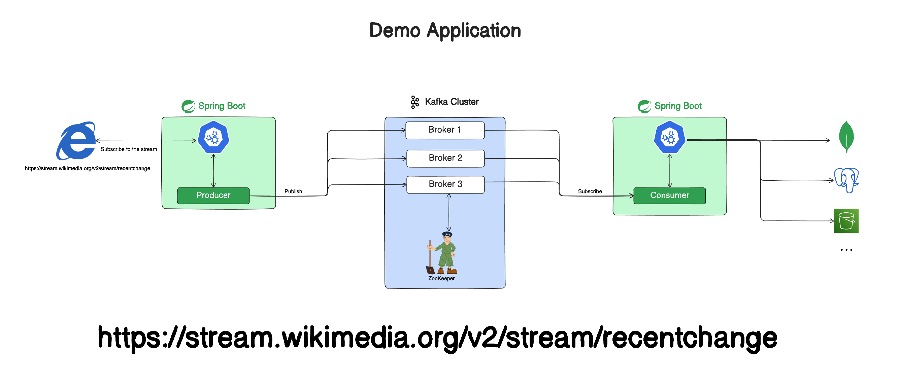

# Spring Boot Kafka Reactive Project

## Requirements

- Java 17 or later
- Apache Kafka (for running locally)
- Maven (or use the included `./mvnw` script)

## Getting Started

### Running Kafka

1. **Local Installation:**
   - Install Kafka locally by following the instructions provided in the [official Kafka quickstart guide](https://kafka.apache.org/quickstart).

2. **Using Docker:**
   - Alternatively, you can utilize Docker images to run Kafka:
     ```bash
     docker-compose up
     ```
   - Ensure you have Docker installed on your system before executing the above command.

Follow either of the methods mentioned above to set up and run Kafka for your project.

## Demo Application



To showcase the functionality of the application, I have developed two distinct projects:

1. **Producer Project:**
   The producer project leverages the **Spring Boot Reactive framework** to extract a data stream from [Wikimedia Recent Changes](https://stream.wikimedia.org/v2/stream/recentchange). This project is designed to efficiently read the streaming data and subsequently transmit the messages to a Kafka broker.

2. **Consumer Project:**
   The consumer project complements the aforementioned producer by retrieving messages from the Kafka topic. The retrieved messages are then persisted into a DynamoDB database. This dual-project configuration not only demonstrates the integration of Spring Boot Reactive with Kafka for real-time data processing but also showcases the seamless storage of this data in a DynamoDB database, emphasizing end-to-end functionality within the application.